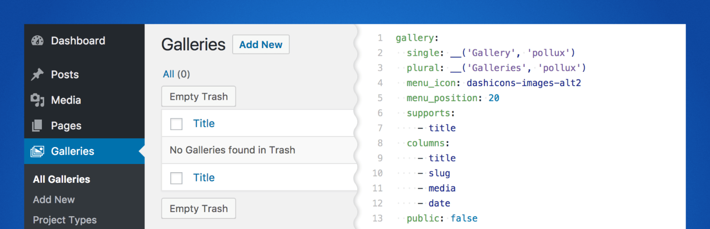

# Pollux

Pollux allows you to easily add custom Post Types, Taxonomies, Meta Boxes, Global Settings, Archive Page meta, and more...all within mere minutes.

Instead of drag-and-drop, all configuration is added using simple [YAML](https://learn-the-web.algonquindesign.ca/topics/markdown-yaml-cheat-sheet/#yaml) markup on the Pollux settings page.

Pollux uses the [Meta Box](https://wordpress.org/plugins/meta-box/) plugin to add custom meta-boxes. If the Meta Box plugin is not installed, Pollux will prompt you to do so on the Pollux settings page.

Please see the [plugin wiki](https://github.com/pryley/pollux/wiki) for complete examples on how to use YAML markup in the plugin. Once you've used it, you'll wonder how you ever managed without it!

Pollux was made to complement themes built on the [Castor framework](https://github.com/pryley/castor-framework) (i.e. [Castor](https://github.com/pryley/castor)), but it can be used with any theme.

## Minimum plugin requirements:

- PHP 5.6
- WordPress 4.7.0

## Frequently Asked Questions

### How do I add Meta Boxes?

Pollux uses the [Meta Box](https://wordpress.org/plugins/meta-box/) plugin to add custom meta-boxes. Adding meta-boxes and meta-box fields is [the same as you would](https://github.com/rilwis/meta-box/blob/master/demo/demo.php) with Meta Box, except instead of registering meta-box arrays with the 'rwmb_meta_boxes' filter hook, you instead enter the arrays as YAML markup in the Pollux Settings.

Please see the [Adding Meta Boxes](https://github.com/pryley/pollux/wiki/Adding-Meta-Boxes) page in the Pollux wiki for detailed information on how to add Meta Boxes with Pollux.

### How do I make conditional Meta Boxes?

Please see the [Meta Box Conditions](https://github.com/pryley/pollux/wiki/Meta-Box-Conditions) page in the Pollux wiki.

### How do I add Custom Post Types?

Please see the [Adding Post Types](https://github.com/pryley/pollux/wiki/Adding-Post-Types) page in the Pollux wiki.

### How do I add Custom Post Type Columns?

Please see the [Adding Post Type Columns](https://github.com/pryley/pollux/wiki/Adding-Post-Type-Columns) page in the Pollux wiki.

### How do I add Custom Taxonomies?

Please see the [Adding Taxonomies](https://github.com/pryley/pollux/wiki/Adding-Taxonomies) page in the Pollux wiki.

### How do set my own defaults?

Please see the [How to create your own defaults](https://github.com/pryley/pollux/wiki/How-to-create-your-own-defaults) page in the Pollux wiki.
